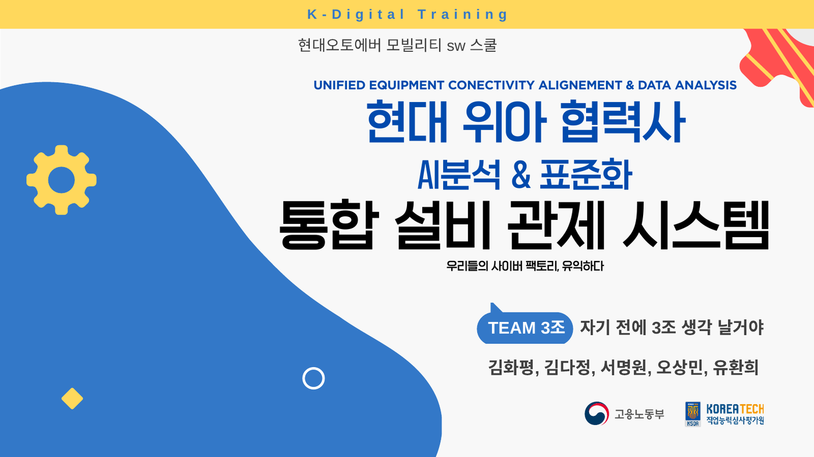
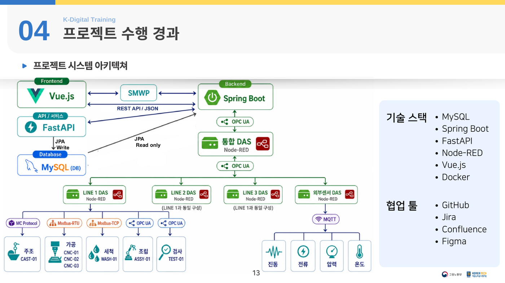
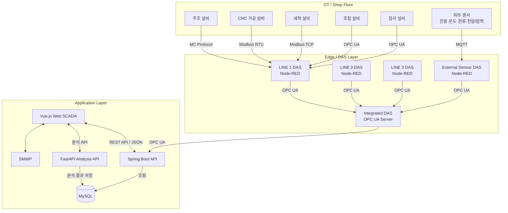
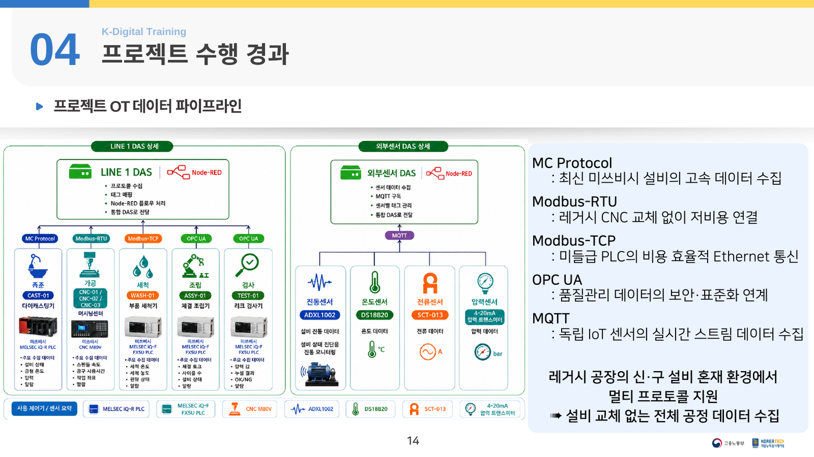
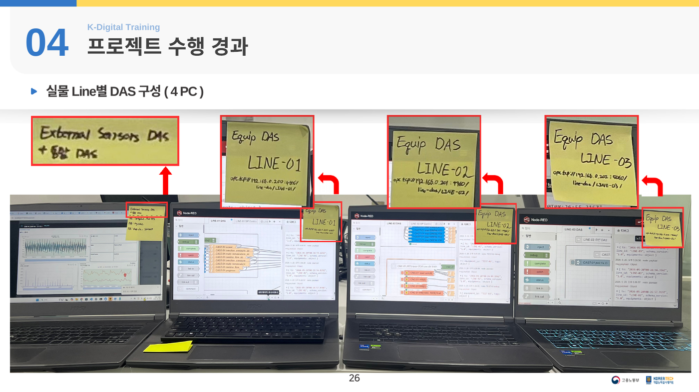
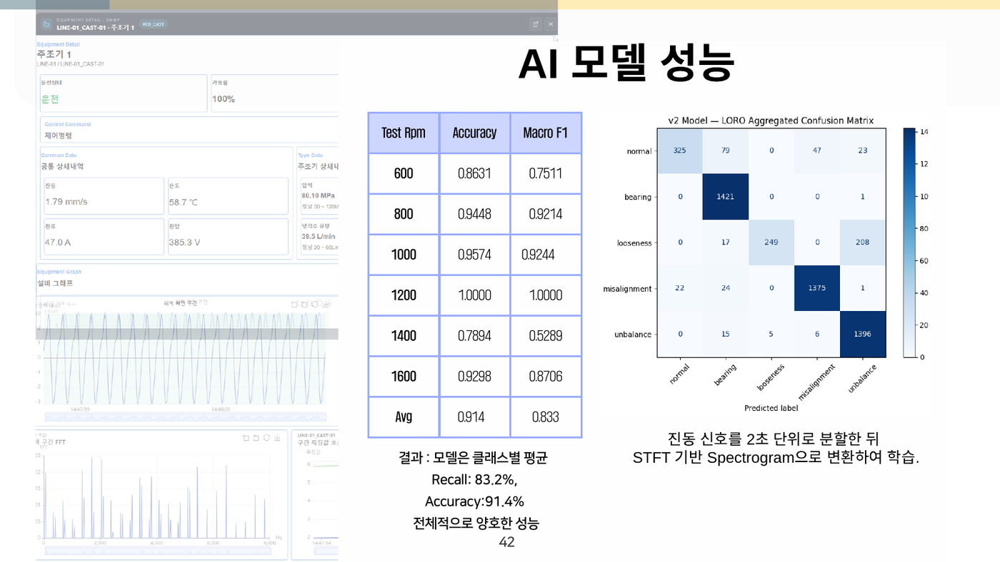
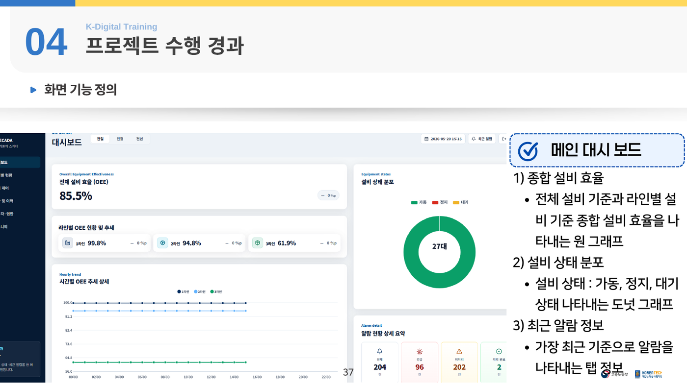
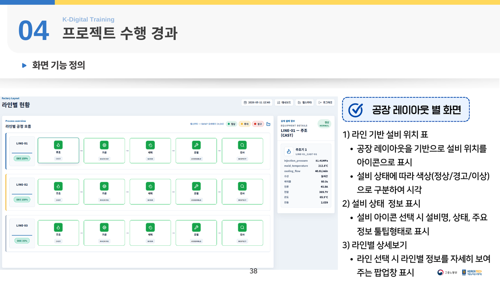
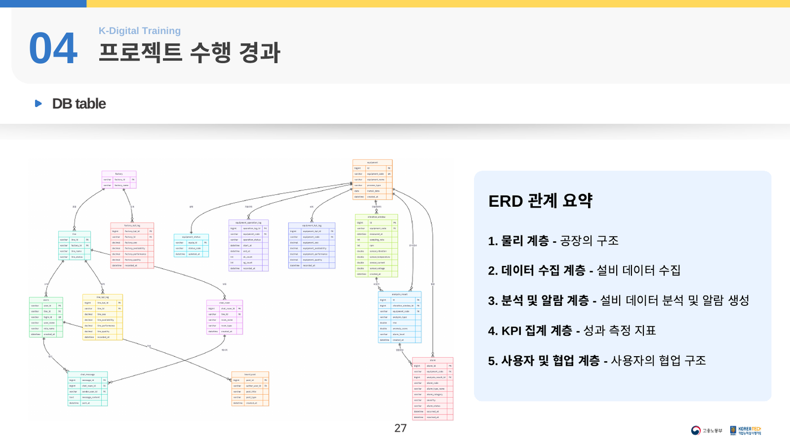
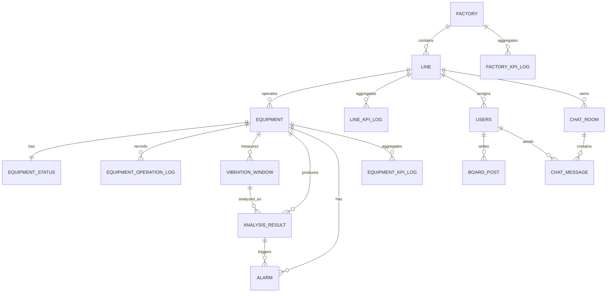

<div align="center">

# UECADA

### 통합 설비 관제 시스템

**Unified Equipment Connectivity Alignment & Data Analysis**

다양한 산업용 통신 프로토콜로부터 설비·센서 데이터를 수집하고,  
OPC UA 기반으로 표준화하여 실시간 관제·예지보전(PHM)·알람·KPI 분석을 제공하는 스마트팩토리 SCADA 프로젝트


https://github.com/user-attachments/assets/947b5121-ca4c-4678-a107-c56b628c4043


<br/>


</div>




---

## 목차

1. [프로젝트 소개](#프로젝트-소개)
2. [추진 배경](#추진-배경)
3. [프로젝트 목표](#프로젝트-목표)
4. [핵심 성과](#핵심-성과)
5. [시스템 구성](#시스템-구성)
6. [OT 데이터 파이프라인](#ot-데이터-파이프라인)
7. [설비 및 통신 프로토콜](#설비-및-통신-프로토콜)
8. [데이터 표준화](#데이터-표준화)
9. [예지보전 AI](#예지보전-ai)
10. [주요 기능](#주요-기능)
11. [데이터베이스 설계](#데이터베이스-설계)
12. [기술 스택](#기술-스택)
13. [트러블슈팅](#트러블슈팅)
14. [실행 방법](#실행-방법)
15. [프로젝트 관리](#프로젝트-관리)
16. [팀 구성](#팀-구성)
17. [개발 일정](#개발-일정)
18. [한계 및 개선 방향](#한계-및-개선-방향)

---


[📊 PPT 발표 자료 열기](./docs/presentation/디지털 트윈 프로젝트.pdf)


## 프로젝트 소개

UECADA는 **최신 설비와 노후 설비가 혼재된 제조 현장**을 가정하여 설계한 통합 설비 관제 시스템입니다.

설비마다 서로 다른 통신 방식과 데이터 형식을 사용하더라도 라인별 DAS(Data Acquisition System)에서 데이터를 수집한 뒤, 통합 DAS에서 공통 데이터 모델로 변환하고 OPC UA로 표준화합니다. 표준화된 데이터는 백엔드와 AI 분석 API로 전달되어 웹 기반 SCADA 화면에 표시됩니다.

| 항목 | 내용 |
|---|---|
| 프로젝트명 | UECADA 통합 설비 관제 시스템 |
| 영문명 | Unified Equipment Connectivity Alignment & Data Analysis |
| 수행 과정 | 현대오토에버 모빌리티 SW 스쿨 · K-Digital Training |
| 수행 기간 | 2026.05.11 ~ 2026.05.20 |
| 팀 구성 | 5명 |
| 주요 대상 | 자동차 부품 2차 협력사 제조 현장 |
| 핵심 영역 | OT 데이터 수집, 산업용 통신 표준화, SCADA, PHM, ESG 데이터 관리 |
| 구현 형태 | 3개 생산 라인과 27개 설비를 모사한 분산형 스마트팩토리 프로토타입 |

> 프로젝트 명칭의 기존 발표 자료에는 `Conectivity`, `Alignement` 표기가 사용되었으며, 본 README에서는 올바른 영문 표기인 `Connectivity`, `Alignment`를 사용합니다.

---

## 추진 배경

### 1. 협력사 내 설비 관제 체계 부족

중소·중견 제조 협력사에서는 설비 상태와 공정 이상을 작업자의 경험에 의존하는 경우가 많습니다.

- 설비 데이터를 실시간으로 수집하는 SCADA 부재
- 이상 상태를 조기에 감지할 수단 부족
- 불량 발생 원인과 설비 이력 데이터 미확보
- 설비 고장 이후에 대응하는 사후 정비 중심 운영
- 공정 정지에 따른 납기 지연과 생산성 저하

### 2. 공급망 리스크 확대

단일 협력사의 설비 이상이나 화재가 완성차 생산라인 전체의 생산 차질로 이어질 수 있습니다. 따라서 원청사는 협력사의 설비 상태와 품질 데이터를 실시간 또는 정형화된 형태로 확인할 필요가 있습니다.

### 3. ESG 및 공급망 실사 대응 필요

협력사는 에너지 사용량, 탄소 배출 관련 데이터, 설비 가동률, 정비 이력, 안전 데이터를 체계적으로 수집해야 합니다. 하지만 수동 집계 방식으로는 지속적인 실사와 보고 요구에 대응하기 어렵습니다.

### AS-IS → TO-BE

| AS-IS | TO-BE |
|---|---|
| 작업자 암묵지에 의존한 이상 판단 | 설비·센서 데이터 기반 실시간 이상 감지 |
| 고장 발생 후 긴급 정비 | AI 기반 예지보전으로 사전 조치 |
| 설비별 통신 규격과 태그 체계가 상이 | OPC UA 기반 데이터·주소·태그 표준화 |
| 불량 원인과 설비 이력 추적 어려움 | 공정·설비·알람·분석 이력의 구조적 저장 |
| ESG 데이터를 수동 취합 | 에너지·가동·정비 데이터 자동 수집 및 보고 기반 마련 |

---

## 프로젝트 목표

UECADA는 다음 네 가지 가치를 중심으로 설계했습니다.

### 1. 협력사 데이터 표준화

- 설비·센서별 데이터 형식을 공통 구조로 변환
- 설비 ID, 라인 ID, 공정 ID, 상태 코드, 태그명 규칙 통일
- 원청과 협력사 간 데이터 연계 기반 확보

### 2. 공정 이상 실시간 감지

- 온도, 압력, 진동, 전류 등 주요 설비 데이터 모니터링
- 임계값 및 AI 분석 결과를 이용한 이상 상태 판정
- 위험 징후 발생 시 알람 생성 및 이력 관리

### 3. AI 기반 예지보전

- 진동 데이터를 이용한 설비 상태 분류
- STFT 기반 Spectrogram 분석
- 위험도, 신뢰도, 이상 추이를 설비 상세 화면에 표시

### 4. ESG 실사 대응 자동화 기반

- 설비 가동률, 에너지 사용량, 정비 이력 자동 수집
- 협력사별 운영 데이터 리포트 생성 기반 마련
- 공급망 실사 및 품질 감사 대응을 위한 데이터 추적성 확보

---

## 핵심 성과

- **3개 생산 라인, 총 27개 설비**를 모사한 스마트팩토리 환경 구성
- MC Protocol, Modbus RTU, Modbus TCP, OPC UA, MQTT를 이용한 **멀티 프로토콜 수집 구조 구현**
- 라인별 DAS와 외부 센서 DAS를 통합하는 **분산형 데이터 수집 아키텍처 구현**
- 설비별 상이한 데이터를 공통 모델로 변환하고 **OPC UA 기반 표준화 파이프라인 구성**
- Vue.js 기반 웹 SCADA에서 공장·라인·설비·알람·KPI 정보 시각화
- 진동 신호를 이용한 예지보전 AI 모델에서 **평균 Accuracy 91.4%, Macro F1 83.3%** 확인
- 실제 라인 격리 환경을 모사하기 위해 **4대 PC에 라인별 DAS와 통합 DAS를 분산 배치**
- GitHub, Jira, Confluence, ADR을 이용한 코드·일정·의사결정·산출물 관리

> AI 성능은 프로젝트에서 구성한 테스트 데이터와 시뮬레이션 환경 기준입니다. 실제 설비에 적용하려면 현장 데이터 기반의 재학습과 추가 검증이 필요합니다.

---

## 시스템 구성



### 전체 아키텍처



### 서비스별 역할

| 구성 요소 | 역할 |
|---|---|
| 설비 시뮬레이터 | 생산 설비의 운전 상태, 설정값, 센서값, 공정 진행률 생성 |
| 라인별 DAS | 라인 내 서로 다른 프로토콜의 설비 데이터를 수집하고 태그 매핑 수행 |
| 외부 센서 DAS | MQTT로 수신한 외부 센서 데이터를 공통 구조로 변환 |
| 통합 DAS | 3개 라인과 외부 센서 데이터를 통합하고 OPC UA 서버로 제공 |
| Spring Boot | 사용자 인증, 설비·라인·알람·KPI·커뮤니티 조회 API 제공 |
| FastAPI | 진동 데이터 전처리, 특징 추출, AI 추론, 분석 결과 저장 |
| MySQL | 공장 구조, 설비 상태, 운전 이력, 진동 데이터, 분석 결과, 알람, KPI 저장 |
| Vue.js | 공장·라인·설비·알람·사용자·커뮤니티 화면 제공 |
| SMWP | 웹 SCADA 화면 및 설비 시각화 연계 |

---

## OT 데이터 파이프라인



### 데이터 처리 흐름

1. 설비 시뮬레이터와 PLC가 설비별 운전·센서 데이터를 생성합니다.
2. 라인별 Node-RED DAS가 설비 프로토콜에 맞춰 데이터를 수집합니다.
3. 외부 센서 데이터는 MQTT Topic을 통해 외부 센서 DAS로 전달됩니다.
4. 각 DAS는 설비 ID, 라인 ID, 태그명, 단위, 데이터 타입을 공통 규칙으로 변환합니다.
5. 통합 DAS는 라인 1~3과 외부 센서 데이터를 수집하여 최신 Snapshot을 구성합니다.
6. 통합된 데이터는 OPC UA 서버를 통해 백엔드에 전달됩니다.
7. 진동 데이터는 FastAPI에서 특징 추출과 모델 추론을 수행합니다.
8. 처리 결과는 MySQL에 저장되고 웹 SCADA에서 실시간·이력 데이터로 시각화됩니다.

### 실제 분산 환경 모사



프로젝트에서는 라인 간 네트워크가 분리된 현장을 가정하여 다음과 같이 구성했습니다.

- PC 1: 외부 센서 DAS 및 백엔드 구성
- PC 2: LINE 1 DAS
- PC 3: LINE 2 DAS
- PC 4: LINE 3 DAS
- 라우터를 이용해 각 PC의 OPC UA Endpoint를 통합 DAS에서 구독

이 구조를 통해 단일 PC 내부 테스트를 넘어 **물리적으로 분리된 여러 PC와 Docker 환경 간 데이터 연동**을 검증했습니다.

---

## 설비 및 통신 프로토콜

공장은 총 3개 라인으로 구성되며, 각 라인은 동일한 설비 구성을 가집니다.

| 공정 | 라인당 수량 | 전체 수량 | 주요 프로토콜 | 예시 데이터 |
|---|---:|---:|---|---|
| 주조(CAST) | 1 | 3 | MC Protocol | 사출 압력, 금형 온도, 냉각 유량 |
| 가공(CNC) | 3 | 9 | Modbus RTU | 스핀들 속도, 공구 사용량, 냉각수 유량 |
| 세척(WASH) | 1 | 3 | Modbus TCP | 세척 농도, 세척 온도, 세척 압력 |
| 조립(ASSY) | 2 | 6 | OPC UA | 체결 토크, 체결 각도, 압입력 |
| 검사(TEST) | 2 | 6 | OPC UA | 보어 치수, 홀 치수, 검사 결과 |
| 합계 | 9 | 27 | 멀티 프로토콜 | 설비 상태 및 공정 데이터 |

### 프로토콜 선정 이유

| 프로토콜 | 적용 목적 |
|---|---|
| MC Protocol | 최신 Mitsubishi PLC의 고속 데이터 수집 |
| Modbus RTU | 레거시 CNC를 교체하지 않고 저비용으로 연결 |
| Modbus TCP | Ethernet 기반 PLC의 비용 효율적인 데이터 통신 |
| OPC UA | 품질·공정 데이터를 보안성과 상호운용성을 갖춘 표준 구조로 연결 |
| MQTT | 독립형 IoT 센서의 실시간 스트림 데이터 수집 |
| UDS | 동일 호스트 내부의 로컬 설비 시뮬레이터 관제 |

<details>
<summary><strong>설비 태그 예시 보기</strong></summary>

### 주조 설비

| 태그 | 역할 | 타입 | 주소 예시 |
|---|---|---|---|
| `power` | 전원 상태 | Boolean | `M0` |
| `injection_pressure_sp` | 사출 압력 설정값 | Float | `D0` |
| `mold_temperature_sp` | 금형 온도 설정값 | Float | `D2` |
| `cooling_flow_sp` | 냉각 유량 설정값 | Float | `D4` |
| `injection_pressure` | 사출 압력 측정값 | Float | `D100` |
| `mold_temperature` | 금형 온도 측정값 | Float | `D102` |
| `cooling_flow` | 냉각 유량 측정값 | Float | `D104` |
| `progress` | 공정 진행률 | Float | `D106` |

### 가공 설비

| 태그 | 역할 | 타입 | 주소 예시 |
|---|---|---|---|
| `power` | 전원 상태 | Boolean | `coil:0` |
| `spindle_speed_sp` | 스핀들 속도 설정값 | Integer | `hr:0` |
| `spindle_speed` | 스핀들 속도 측정값 | Integer | `hr:2` |
| `tool_usage_sp` | 공구 사용량 설정값 | Float | `hr:1000` |
| `tool_usage` | 공구 사용량 측정값 | Float | `hr:1002` |
| `coolant_flow` | 냉각수 유량 | Float | `hr:1006` |

### 조립 설비

| 태그 | 역할 | 타입 | OPC UA NodeId 예시 |
|---|---|---|---|
| `power` | 전원 상태 | Boolean | `ns=2;s=power` |
| `tightening_torque` | 체결 토크 | Float | `ns=2;s=tightening_torque` |
| `tightening_angle` | 체결 각도 | Float | `ns=2;s=tightening_angle` |
| `press_force` | 압입력 | Float | `ns=2;s=press_force` |

</details>

---

## 데이터 표준화

설비별 원천 데이터는 주소 체계, 데이터 타입, 단위, 태그명이 서로 다릅니다. UECADA는 DAS에서 이를 공통 데이터 모델로 변환합니다.

### 표준 데이터 예시

```json
{
  "timestamp": "2026-05-20T02:38:31.873Z",
  "line_id": "LINE-01",
  "equipment_id": "WASH-01",
  "equipment_type": "WASH",
  "instance_id": "LINE-01-WASH-01",
  "operation": {
    "status": "RUN",
    "progress": 72.5
  },
  "sample": {
    "sensor_id": "TEMP-01",
    "value": 62.8,
    "unit": "celsius"
  }
}
```

### 표준화 규칙

- `LINE-{번호}` 형식의 라인 ID
- `{설비유형}-{번호}` 형식의 설비 ID
- `{LINE_ID}-{EQUIPMENT_ID}` 형식의 인스턴스 ID
- 설정값은 `_sp`, 측정값은 센서 의미를 나타내는 태그명 사용
- 상태 코드는 `RUN`, `STOP`, `IDLE` 등 공통 코드로 변환
- 설비 데이터와 외부 센서 데이터를 동일한 Timestamp 기준으로 관리
- 통합 DAS의 OPC UA Namespace와 NodeId 규칙을 공통화

---

## 예지보전 AI

### 분석 절차


### 화면 제공 정보

- 진동, 온도, 전류, 전압 등 현재 센서값
- 설비 상태 분석 결과와 신뢰도
- 주요 진동 주파수 성분
- 시간 구간별 특징값과 이상치 점수 추이
- 이상 상태 발생 시 분석 결과와 연결된 알람



### 모델 성능

| Test RPM | Accuracy | Macro F1 |
|---:|---:|---:|
| 600 | 0.8631 | 0.7511 |
| 800 | 0.9448 | 0.9214 |
| 1000 | 0.9574 | 0.9244 |
| 1200 | 1.0000 | 1.0000 |
| 1400 | 0.7894 | 0.5289 |
| 1600 | 0.9298 | 0.8706 |
| **평균** | **0.9140** | **0.8330** |

- 평균 Accuracy: **91.4%**
- 클래스별 평균 Recall: **83.2%**
- 평균 Macro F1: **83.3%**
- 1,400 RPM 구간은 다른 RPM 대비 성능이 낮아 추가 데이터 확보와 모델 개선이 필요합니다.

---

## 주요 기능

### 1. 로그인 및 사용자 인증

- 등록된 사용자 정보 기반 로그인
- 회원가입
- 아이디·비밀번호 찾기
- 사용자별 최종 로그인 시각 관리

### 2. 메인 대시보드



- 전체 공장 OEE(Overall Equipment Effectiveness)
- 라인별 OEE 및 시간대별 추이
- 설비 상태 분포: 가동·정지·대기
- 전체·긴급·미처리·처리 완료 알람 요약
- 최근 알람 상세 정보

### 3. 공장 레이아웃 및 라인 현황



- 실제 공정 순서에 따른 설비 배치 시각화
- 설비 상태별 색상 구분
- 설비 선택 시 현재 상태와 주요 센서값 표시
- 라인별 OEE, 설비 상태 분포, 라인 밸런싱, UPH 달성률 제공

### 4. 설비별 모니터링

- 설비 카테고리별 운전 상태, 가동률, 불량 수량 조회
- 주조기: 압력, 금형 온도, 냉각 유량
- 가공기: 스핀들 속도, 공구 사용량, 냉각수 유량
- 세척기: 농도, 온도, 압력
- 조립기: 체결 토크, 체결 각도, 압입력
- 검사기: 보어 치수, 홀 치수, 검사 결과

### 5. 설비 상세 분석

- 진동·온도·전류·전압 데이터 확인
- 예지보전 AI 상태 분석과 신뢰도 확인
- 진동 주파수 성분 및 Spectrogram 시각화
- 이상치 점수와 특징값의 시간대별 Trend 분석

### 6. 알람 관리

- 전체 알람, 긴급 알람, 처리 완료, 미처리 건수 집계
- 시간대별 알람 발생 추이
- 설비별·유형별 알람 발생 빈도
- 알람 발생 시간, 설비, 유형, 심각도, 처리 상태 관리
- AI 분석 알람과 임계값 알람을 하나의 테이블에서 통합 관리

### 7. 사용자 및 권한 관리

- 관리자·작업자 역할 구분
- 사용자 목록 및 소속 라인 관리
- 관리자의 사용자 권한 변경

### 8. 커뮤니티

- 라인별 작업자 그룹화
- 관리자 공지 게시판
- 작업 지시와 현장 정보 공유를 위한 채팅
- 공장 현황 자동 문서화 기능

---

## 데이터베이스 설계



데이터베이스는 시스템 책임에 따라 다섯 계층으로 구분했습니다.

| 계층 | 주요 역할 | 주요 테이블 |
|---|---|---|
| 물리 계층 | 공장·라인·설비 구조 | `factory`, `line`, `equipment` |
| 데이터 수집 계층 | 현재 상태·운전 이력·센서 원시 데이터 | `equipment_status`, `equipment_operation_log`, `vibration_window` |
| 분석 및 알람 계층 | AI 분석 결과와 알람 관리 | `analysis_result`, `alarm` |
| KPI 집계 계층 | 설비·라인·공장 단위 성과 집계 | `equipment_kpi_log`, `line_kpi_log`, `factory_kpi_log` |
| 사용자 및 협업 계층 | 사용자·게시판·채팅 | `users`, `board_post`, `chat_room`, `chat_message` |

### 핵심 관계



### 설계 포인트

- `equipment_code`를 설비 자연키이자 외부 시스템 식별자로 활용
- 현재 상태와 이력 데이터를 분리해 조회 성능과 추적성을 확보
- AI 알람은 `analysis_result_id`와 연결
- 임계값 기반 알람은 `analysis_result_id = NULL`을 허용
- OEE는 가용성(Availability) × 성능(Performance) × 품질(Quality)로 계산
- KPI는 설비 → 라인 → 공장 순서로 Roll-up 집계

---

## 기술 스택

### Application

| 구분 | 기술 | 역할 |
|---|---|---|
| Frontend | Vue.js | 웹 SCADA 및 사용자 화면 |
| Backend | Spring Boot | 인증, 설비·라인·알람·KPI·커뮤니티 API |
| AI API | FastAPI | 진동 데이터 분석, 특징 추출, 모델 추론 |
| Database | MySQL | 설비·분석·알람·KPI·사용자 데이터 저장 |
| Data Acquisition | Node-RED | 프로토콜별 수집, 변환, 통합 DAS 구성 |
| SCADA Integration | SMWP | 웹 기반 설비 관제 화면 연계 |
| Container | Docker | 서비스 실행 환경 구성 |

### Industrial Communication

- MC Protocol
- Modbus RTU
- Modbus TCP
- OPC UA
- MQTT
- Unix Domain Socket

### Collaboration

- GitHub
- Jira
- Confluence
- Figma
- ADR(Architecture Decision Record)

---

## 트러블슈팅

### 1. 모든 진동 Raw 데이터를 DB에 저장할 때 발생하는 문제

#### 문제

진동 원시 데이터를 지속적으로 저장하면 DB 용량과 네트워크 트래픽이 급격히 증가합니다.

프로젝트 조건에서 27개 설비의 진동 Window를 10분마다 저장할 경우 예상 연간 저장량은 다음과 같습니다.

```text
0.12 MB × 51,840 Window/Year × 27 Equipment × 1.3 Overhead
≈ 220 GB/Year
```

#### 해결 전략

- Feature 값은 초 단위로 저장
- Raw 진동 데이터는 10분 주기로 대표 Window만 저장
- 알람 발생 시점의 Window는 원인 분석과 모델 개선을 위해 별도 저장
- 최근 데이터는 Hot Tier에 유지
- 장기 보관 데이터는 Cold Tier로 이동

### 2. Spring Boot와 FastAPI의 DB 역할 충돌

#### 문제

두 백엔드가 동일 데이터를 동시에 읽고 쓰면 책임이 모호해지고 네트워크·DB 부하가 증가할 수 있습니다.

#### 해결

- FastAPI: 센서·AI 분석 결과 Write 담당
- Spring Boot: 화면 제공을 위한 Read 중심 API 담당
- 서비스별 책임을 분리하여 데이터 흐름을 단순화

### 3. 서로 다른 PC의 Docker 서비스 간 통신

#### 문제

라인별 DAS가 각기 다른 PC와 Docker 환경에 실행되기 때문에 Docker 내부 주소만으로는 다른 PC의 서비스에 접근할 수 없습니다.

#### 해결 방향

- 라인별 DAS를 개별 PC에 배치
- 각 DAS의 OPC UA Endpoint를 호스트 네트워크에서 접근 가능하도록 구성
- 라우터를 통해 PC 간 통신 경로 확보
- 통합 DAS가 각 라인 DAS를 OPC UA Client로 구독
- Address, Namespace, NodeId, Tag 규칙을 통일해 연결 대상이 달라도 같은 로직으로 처리

### 4. 서로 다른 설비 프로토콜과 데이터 형식

#### 문제

동일한 의미의 데이터가 설비마다 서로 다른 주소, 타입, 이름으로 제공됩니다.

#### 해결

- 설비별 태그 명세서를 먼저 작성
- Line DAS에서 프로토콜별 원천 주소를 공통 태그로 매핑
- 통합 DAS에서는 공통 데이터 모델만 처리
- 백엔드와 프론트엔드가 설비 프로토콜을 알 필요가 없도록 추상화

---

## 실행 방법

> 이 README는 프로젝트 결과보고서를 기준으로 작성했습니다. 실제 포트, 이미지 태그, 서비스 이름, 필수 환경변수는 저장소의 `docker-compose.yml`, `.env.example`, 각 하위 README를 기준으로 확인해야 합니다.

### 사전 요구사항

- Git
- Docker 및 Docker Compose
- 직접 실행 시 JDK, Python, Node.js, MySQL, Node-RED 실행 환경

### Docker Compose 실행

```bash
# 1. 저장소 복제
git clone <repository-url>
cd UECADA

# 2. 환경변수 파일 생성
cp .env.example .env

# 3. .env에 DB, API, MQTT, OPC UA 관련 값을 입력

# 4. 전체 서비스 빌드 및 실행
docker compose up -d --build

# 5. 상태 확인
docker compose ps

# 6. 로그 확인
docker compose logs -f
```

### 종료

```bash
docker compose down
```

### 권장 실행 순서

1. MySQL 및 초기 스키마
2. MQTT Broker와 Node-RED
3. 설비·외부 센서 시뮬레이터
4. 라인별 DAS
5. 통합 DAS OPC UA Server
6. FastAPI AI 분석 서비스
7. Spring Boot API 서버
8. Vue.js Frontend

### 실행 전 확인사항

- `.env`와 설정 파일에 비밀번호·토큰을 직접 커밋하지 않습니다.
- PC가 여러 대라면 `localhost` 대신 실제 호스트 IP를 사용합니다.
- OPC UA Server Endpoint와 방화벽 허용 포트를 확인합니다.
- MQTT Topic 규칙과 설비 ID가 태그 명세서와 일치하는지 확인합니다.
- 데이터베이스 초기 스키마와 Seed 데이터 적용 여부를 확인합니다.

---

## 프로젝트 관리

### Git 브랜치 전략

| 브랜치 | 용도 |
|---|---|
| `main` | 배포 및 최종 통합 버전 |
| `develop` | 개발 기능 통합 |
| `feature/*` | 기능 단위 개발 |

### 문서 관리 원칙

- Confluence를 SSOT(Single Source of Truth)로 사용
- 프로젝트 생명주기에 따라 `00`~`05` 번호 기반 폴더 구성
- 기술 선택과 구조 변경 이유를 ADR로 기록
- 날짜별 회의록과 일일보고서로 진행 이력 추적

```text
UECADA Docs
├── 00. 프로젝트 홈
│   ├── 문서 인덱스
│   └── 자료 조사
├── 01. 프로젝트 관리
│   ├── 프로젝트 개요서
│   └── 회의록
├── 02. 요구사항 및 설계
│   ├── 요구사항 정의서
│   ├── 시스템 아키텍처 개요서
│   ├── 설비 및 공정 정의서
│   ├── 화면 기능 정의서
│   ├── API 명세서
│   ├── DB 설계서
│   ├── 태그 명세서
│   └── 프론트엔드 UI/UX 설계
├── 03. 개발 협업
│   ├── 협업 컨벤션
│   └── ADR
├── 04. 테스트 및 운영
└── 05. 온보딩
    └── 온보딩 가이드
```

### 주요 산출물

| 문서 | 내용 |
|---|---|
| Architecture 문서 | 전체 시스템 구조, 데이터 흐름, API 연동 구조 |
| API 명세서 | Endpoint, Request, Response, 인증 방식 |
| DB 설계서 | 테이블, 컬럼, 관계, 인덱스 |
| AI 모델 문서 | 데이터셋, 전처리, Feature, 모델 구조, 평가 지표 |
| Troubleshooting 문서 | 오류 원인, 해결 방법, 재발 방지 방안 |

---

## 팀 구성

| 이름 | 역할 | 담당 업무 |
|---|---|---|
| 김화평 | 팀장 | 역할 분담 및 일정 조정, 센서 및 통합 DAS 구성, 예지보전 AI 모델 학습 |
| 김다정 | 팀원 | DB 설계 및 구축, 분석 API 제작, DB·Backend 연동 |
| 서명원 | 팀원 | 웹 SCADA 화면 제작, Frontend 기초 설계 |
| 오상민 | 팀원 | 설비 시뮬레이터 제작, 설비 프로토콜 표준화, 라인별 DAS 구성 |
| 유환희 | 팀원 | UI/UX 디자인, Frontend API 연동 |

---

## 개발 일정

| 단계 | 기간 | 주요 작업 |
|---|---|---|
| 사전 기획 | 05.11 | 프로젝트 목표·기능 범위 정의, 역할 분담, 기획서 작성 |
| 데이터 수집 | 05.12 ~ 05.14 | 설비별 태그 정의, 시뮬레이터와 센서 데이터 생성, DAS 구성 |
| Database | 05.12 ~ 05.13 | 테이블 구조와 관계 설계, DB 구축 |
| Backend | 05.12 ~ 05.19 | API 설계, 기능 구현, DB·Frontend 연동 |
| Frontend | 05.12 ~ 05.19 | UI/UX, 페이지, 웹 SCADA 화면 구현 |
| 기능 통합 | 05.19 | FE·BE·DB·DAS·AI 기능 통합 및 검증 |
| 마무리 | 05.20 | 시연 영상, 발표 자료, 최종 산출물 정리 |

---

## 한계 및 개선 방향

### 현재 한계

- 주로 시뮬레이터 기반 데이터를 사용함
- 실제 설비의 노이즈, 결측, 통신 지연, 센서 편차가 충분히 반영되지 않음
- AI 성능이 특정 RPM 구간에서 낮아지는 현상이 존재함
- 실제 생산 환경 수준의 보안, 장애 복구, 고가용성 검증은 미완료
- 테스트 및 운영 문서 영역이 충분히 채워지지 않음

### 향후 개선

1. **실제 센서 및 PLC 연동**
   - 실제 진동 센서와 설비 데이터를 수집해 시뮬레이션 결과와 비교
   - 현장 데이터 기반으로 태그, 단위, 수집 주기 보정

2. **AI 모델 고도화**
   - 1,400 RPM 등 취약 구간 데이터 보강
   - 설비별 Domain Shift 대응
   - 모델 버전, 학습 데이터, 평가 이력 관리

3. **저장 구조 확장**
   - Hot/Cold Tier 적용
   - 시계열 데이터베이스 또는 Object Storage 검토
   - 데이터 보존 기간과 압축 정책 정의

4. **운영 안정성 강화**
   - OPC UA 인증서와 사용자 권한 적용
   - MQTT TLS 및 Topic ACL 적용
   - 서비스 Health Check, 재시도, 장애 알림, 중앙 로그 구성

5. **품질 및 배포 자동화**
   - 단위·통합·E2E 테스트 추가
   - Docker 이미지 빌드와 배포 CI/CD 구성
   - 개발·검증·운영 환경 분리

6. **ESG 보고 기능 구체화**
   - 에너지·탄소 배출량 계산 규칙 정의
   - 월간 리포트와 공급망 실사 제출 포맷 자동 생성
   - 데이터 근거와 변경 이력 추적 기능 강화

---

## 프로젝트 평가

프로젝트 팀은 결과물의 기획 의도 부합도와 완성도를 **9.9/10**으로 자체 평가했습니다.

잘한 점으로는 실제 공장과 유사한 분산 DAS 환경 구성, 멀티 프로토콜 통신, 예지보전 AI 결과 도출, 기능별 Frontend·Backend 구성, 체계적인 협업 문서화를 선정했습니다.

가장 중요한 후속 과제는 시뮬레이터를 넘어 **실제 센서와 설비 데이터를 연결해 전체 파이프라인의 현장 적용 가능성을 검증하는 것**입니다.

---

## License

라이선스는 현재 명시되지 않았습니다. 외부 공개 전 팀 내부 합의를 통해 라이선스를 추가해야 합니다.

---

<div align="center">

**Our Cyber Factory, UECADA**

</div>
