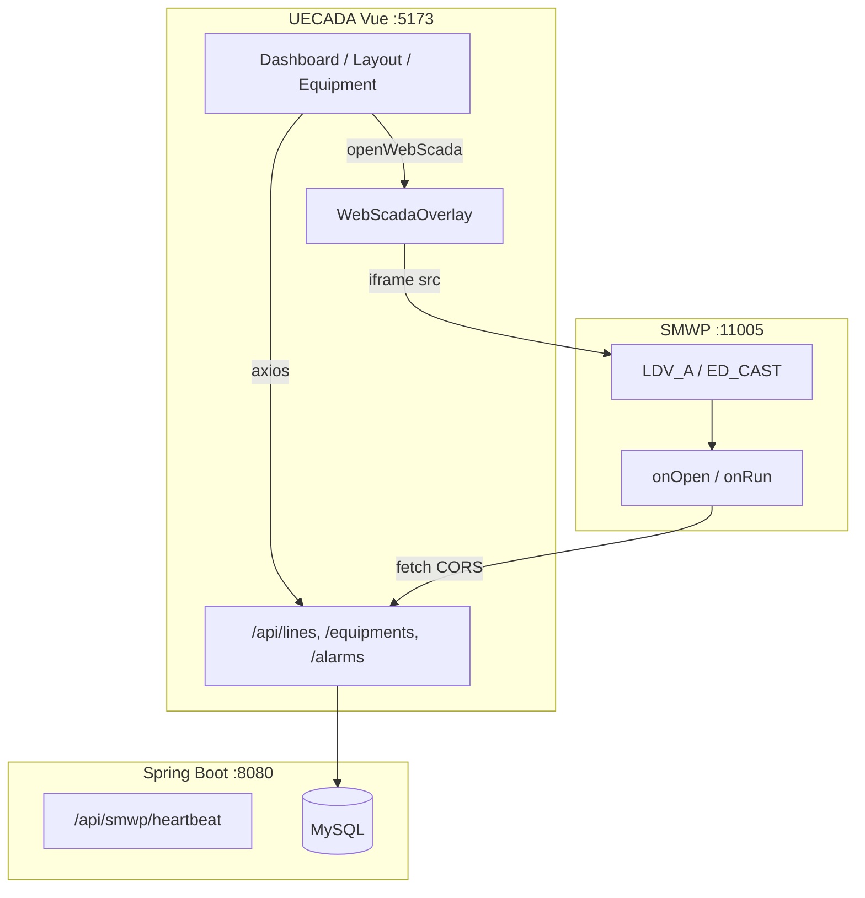
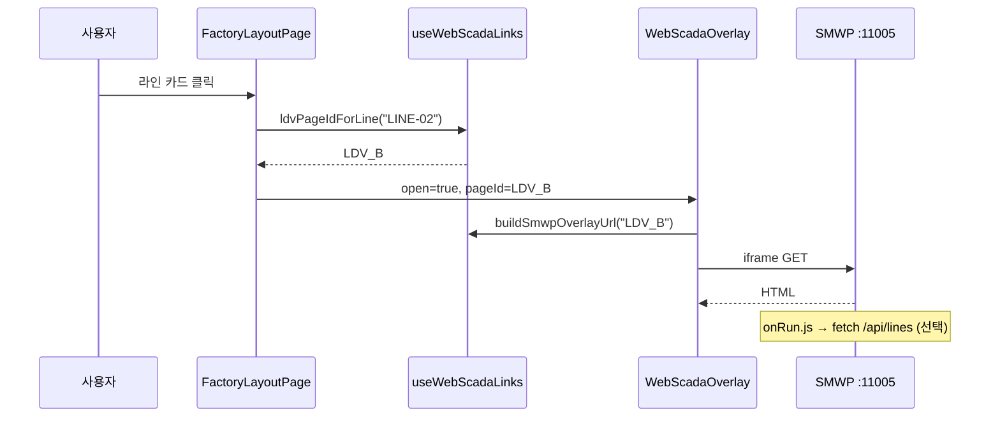

# UECADA 프론트·백엔드·SMWP(WebSCADA) 연동 명세서

> **대상:** 초보 개발자  
> **기준 코드:** `feat/FE_BE_fin_0519`  
> **작업 경로:** `UECADA/frontend/UECADA_3`, `UECADA/backend`, `UECADA/docs/`  
> **관련 문서:** `docs/smwp-data-binding.md`, `docs/smwp-snippets/*.js`

---

## 용어 정리

| 용어 | 의미 |
|------|------|
| **UECADA** | Vue 프론트 + Spring Boot 백엔드 모니터링 앱 |
| **SMWP / WebSCADA** | KingPortal 기반 외부 웹스카다 서버 (보통 `:11005`) |
| **오버레이** | Vue 화면 위 `<dialog>` + `<iframe>`으로 SMWP를 띄우는 UI |
| **pageId** | SMWP URL 해시 `#` 뒤 화면 ID (`LDV_A`, `ED_CAST` 등) |

환경 변수는 `VITE_SWMP_*` 이지만 문서·주석에서는 **SMWP**로 통일합니다.

---

# 1. 프론트엔드 전체 구조

## 1.1 큰 그림

```
[브라우저]
    │
    ├─ Vue 3 앱 (Vite, :5173)
    │     ├─ 화면(Pages) ── composables ── api/*.ts ── axios
    │     │                                      │
    │     │                                      ▼
    │     │                            Spring Boot (:8080) /api/**
    │     │                                      │
    │     │                                      ▼
    │     │                                    MySQL
    │     │
    │     └─ WebScadaOverlay (iframe)
    │              │
    │              ▼ (별도 origin, URL 직접 로드)
    │         SMWP 서버 (:11005)
    │              │
    │              └─ (선택) SMWP 스크립트가 fetch → UECADA /api/**
    │
    └─ 로그인 토큰: Pinia auth → axios Authorization 헤더
```

**핵심**

- **공장 레이아웃·대시보드 숫자** → Vue가 백엔드 API 호출
- **웹스카다 화면** → iframe이 SMWP에 직접 접속
- **SMWP 안 라벨 실시간 값** → (설정 시) SMWP 스크립트가 백엔드 API를 직접 `fetch`

---

## 1.2 폴더 구조 (`frontend/UECADA_3/src`)

```
src/
├── main.ts              # Pinia, Router, Vue Query, axios 인터셉터
├── App.vue              # <RouterView />
├── router/index.ts      # URL ↔ 페이지
├── stores/auth.ts       # 로그인 토큰·역할
│
├── components/          # 페이지 단위 Vue
│   ├── LoginPage.vue
│   ├── DashboardPage.vue
│   ├── FactoryLayoutPage.vue    # 공장 레이아웃 + 웹스카다
│   ├── EquipmentDetailPage.vue  # 설비 상세 + 웹스카다
│   ├── AlarmPage.vue
│   ├── WebScadaOverlay.vue      # SMWP iframe 공통
│   └── equipment/               # 설비 UI 조각
│
├── composables/
│   ├── useFactoryLayout.ts      # 레이아웃 API
│   ├── useWebScadaLinks.ts      # SMWP URL 조합 ★
│   ├── useDashboard.ts
│   └── ...
│
├── api/
│   ├── client.ts        # axios (baseURL)
│   ├── interceptors.ts
│   ├── lineApi.ts
│   ├── equipmentApi.ts
│   └── alarmApi.ts ...
│
├── types/
└── constants/polling.ts
```

---

## 1.3 앱 시작 (`main.ts`)

1. `createApp(App)`
2. **Pinia** — 로그인 상태
3. **axios 인터셉터** — `Authorization: Bearer …`
4. **vue-router** — 페이지 전환
5. **@tanstack/vue-query** — API 캐시·재조회

---

## 1.4 라우팅

| 경로 | name | 컴포넌트 | 설명 |
|------|------|----------|------|
| `/login` | login | LoginPage | 로그인 (공개) |
| `/dashboard` | dashboard | DashboardPage | OEE·차트 |
| `/layout` | layout | FactoryLayoutPage | 공장 레이아웃 + 웹스카다 |
| `/equipment` | equipment | EquipmentDetailPage | 설비 + 웹스카다 |
| `/alarms` | alarms | AlarmPage | 알람 |
| `/lines` | lines | LineDetailPage | 라인 상세 |
| `/users` | users | UserManagementPage | 관리자만 |
| `/community` | community | CommunityPage | 커뮤니티 |

- `meta.requiresAuth` 페이지는 미로그인 시 `/login`으로 이동
- SMWP 전용 라우트(`/swmp-test`, `/web-scada`)는 **제거됨** → 오버레이만 사용

---

## 1.5 Vue ↔ 백엔드

### 환경 변수 (`.env.example`)

```env
VITE_API_BASE_URL=              # 예: http://localhost:8080
VITE_USE_MOCK_ALARMS=true
VITE_REALTIME_DEMO=true
VITE_SWMP_DEFAULT_URL=http://192.168.0.100:11005/?Pro=myseo_260430#LDV
```

### HTTP

- `src/api/client.ts` — `axios.create({ baseURL: VITE_API_BASE_URL })`
- `src/api/interceptors.ts` — 401 시 세션 삭제 후 로그인 이동

### 예: 공장 레이아웃 데이터

```
FactoryLayoutPage.vue
    └── useFactoryLayout()
            ├── GET /api/lines?factoryId=FACTORY-01
            ├── GET /api/equipments?factoryId=FACTORY-01
            └── GET /api/equipment-status?equipIds=...
```

폴링 주기: `src/constants/polling.ts`

---

## 1.6 웹스카다 관련 파일

| 파일 | 역할 |
|------|------|
| `composables/useWebScadaLinks.ts` | URL·pageId 매핑 |
| `components/WebScadaOverlay.vue` | dialog + iframe |
| `FactoryLayoutPage.vue` | 라인별 웹스카다 열기 |
| `EquipmentDetailPage.vue` | 카테고리별 웹스카다 |
| `.env` `VITE_SWMP_DEFAULT_URL` | SMWP 서버·프로젝트·기본 화면 |

---

# 2. 백엔드와 SMWP 연결·데이터 교환

## 2.1 두 가지 경로

### 경로 A — Vue iframe (화면만)

```
사용자 클릭 → Vue가 URL 조합 → iframe src = SMWP
```

- 백엔드 **미관여** (로그인 프록시 없음)
- SMWP 로그인은 **SMWP 화면에서 사용자 직접**
- Vue는 `#LDV_A` 등 **어떤 페이지를 열지**만 결정

### 경로 B — SMWP 스크립트 → UECADA API

```
SMWP 로드 → onOpen.js → setInterval(onRun.js) → fetch(http://...:8080/api/...) → 태그 write
```

- Vue는 **끼지 않음**
- 브라우저(SMWP origin) → UECADA API (CORS 필요)

---

## 2.2 CORS (`CorsConfig.java`)

SMWP와 API는 origin이 다릅니다. 백엔드에서 허용:

- `http://localhost:*`, `http://127.0.0.1:*`
- `http://222.108.180.36:*`, `https://222.108.180.36:*`

로컬 SMWP IP(`192.168.0.100` 등) 사용 시 패턴 **추가** 필요할 수 있음.

---

## 2.3 SMWP가 쓰는 주요 API

| API | 용도 | DB |
|-----|------|-----|
| `GET /api/lines` | 라인 OEE, UPH | `line`, `line_kpi_log` |
| `GET /api/equipments` | 설비 메트릭 | `equipment`, 데모 store |
| `GET /api/equipment-status` | 가동 상태 | `equipment_status` |
| `GET /api/alarms` | 알람 | `alarm` |
| `GET /api/dashboard/frontend` | 대시보드 | 집계 |
| `POST /api/demo/metrics/push` | 데모 주입 (옵션) | 데모 테이블 |
| `GET /api/smwp/heartbeat` | 연결 테스트 | 메모리 counter |

---

## 2.4 Heartbeat API

`SmwpHeartbeatController` — `/api/smwp/heartbeat`

- SMWP 스크립트·개발자가 백엔드 생존 확인용
- Vue iframe 경로와 **무관**

---

## 2.5 SMWP 편집기 스크립트

| 파일 | 붙이는 위치 |
|------|-------------|
| `docs/smwp-snippets/onOpen.js` | 페이지 **열기 시** |
| `docs/smwp-snippets/onRun.js` | **실행 시** (폴링) |
| `docs/smwp-snippets/onClose.js` | **닫기 시** |

`onOpen.js` 안 `apiBase: 'http://localhost:8080'` — 배포 환경마다 수정 필요.

상세: `docs/smwp-data-binding.md`

---

## 2.6 아키텍처 다이어그램



---

# 3. Vue에서 SMWP를 켤 때 (상세)

## 3.1 설계 원칙 (2026-05-19)

| 하지 않음 | 함 |
|----------|-----|
| `/swmp-proxy/login` 자동 로그인 | `.env` URL + pageId로 iframe 직접 |
| 팝업·테스트 전용 페이지 | `WebScadaOverlay` 하나로 통일 |
| SMWP 자동 로그인 | 사용자가 SMWP에서 직접 로그인 |

---

## 3.2 URL 생성 (`useWebScadaLinks.ts`)

### 환경 변수

```text
VITE_SWMP_DEFAULT_URL=http://192.168.0.100:11005/?Pro=myseo_260430#LDV
```

| 부분 | 예 | 설명 |
|------|-----|------|
| origin:port | `http://192.168.0.100:11005` | SMWP 서버 |
| `?Pro=` | `myseo_260430` | 프로젝트 ID |
| `#` 뒤 | `LDV` | 기본 pageId |

### 허용 호스트

`222.108.180.36`, `192.168.0.100`, `localhost`, `127.0.0.1` — 그 외는 URL 생성 실패.

### 라인 → pageId (공장 레이아웃)

| lineId | pageId |
|--------|--------|
| LINE-01 | LDV_A |
| LINE-02 | LDV_B |
| LINE-03 | LDV_C |
| (기본) | LDV |

함수: `ldvPageIdForLine(lineId)`

### 카테고리 → pageId (설비 상세)

| categoryId | pageId |
|------------|--------|
| casting | ED_CAST |
| machining | ED_CNC |
| washing | ED_WASH |
| assembly | ED_ASSY |
| inspection | ED_TEST |

함수: `edPageIdForCategory(categoryId)`

### 최종 URL

함수: `buildSmwpOverlayUrl(pageId)`  
형식: `{origin}{pathname}?Pro={pro}#{pageId}`

예: `http://192.168.0.100:11005/?Pro=myseo_260430#LDV_B`

---

## 3.3 FactoryLayoutPage 흐름

### 사용자 액션

1. 상단 **「웹스카다」** → 첫 라인 기준
2. **라인 카드** 클릭 → 해당 라인 (`LDV_A` 등)

### 코드

```ts
function openWebScada(lineId?: string): void {
  if (!webScadaReady) return
  const id = lineId ?? factoryLines.value[0]?.id ?? 'LINE-01'
  webScadaOverlayPageId.value = ldvPageIdForLine(id)
  webScadaOverlayTitle.value = lineId ? `${id} 웹스카다` : '웹스카다'
  webScadaOverlayOpen.value = true
}
```

```vue
<WebScadaOverlay
  :open="webScadaOverlayOpen"
  :page-id="webScadaOverlayPageId"
  :title="webScadaOverlayTitle"
  @close="webScadaOverlayOpen = false"
/>
```

`webScadaReady` = `isWebScadaConfigured()` (`.env` URL 유효할 때만)

---

## 3.4 EquipmentDetailPage 흐름

- `webScadaOverlayPageId` = `edPageIdForCategory(selectedCategoryId)`
- `openEquipmentPopup()` → `webScadaOverlayOpen = true`
- 동일 `WebScadaOverlay` 재사용

---

## 3.5 WebScadaOverlay 내부

| 단계 | 동작 |
|------|------|
| 1 | `open=true` → `dialog.showModal()` |
| 2 | `iframeUrl = buildSmwpOverlayUrl(pageId)` |
| 3 | `preconnect` SMWP origin |
| 4 | `<iframe :src="iframeUrl">` → SMWP 직접 요청 |
| 5 | 8초 내 `load` 없으면 폴백 UI |
| 6 | 닫기 → focus 복원, 타이머 해제 |

`VITE_API_BASE_URL`은 iframe 로드에 **사용되지 않음**.

---

## 3.6 시퀀스



---

## 3.7 트러블슈팅

| 증상 | 확인 |
|------|------|
| 웹스카다 버튼 비활성 | `VITE_SWMP_DEFAULT_URL`, ALLOWED_HOSTS |
| iframe 빈 화면 | SMWP :11005 접속, `Pro` 값 |
| 8초 타임아웃 | SMWP 응답 지연 — 새 창에서 URL 테스트 |
| SMWP 숫자 안 바뀜 | onOpen/onRun, apiBase, CORS |
| Vue 숫자만 안 바뀜 | `VITE_API_BASE_URL`, 백엔드, useFactoryLayout |

---

## 3.8 Vue vs SMWP 데이터

| | Vue 화면 | SMWP iframe |
|--|----------|-------------|
| 데이터 | axios → `/api/**` | SMWP 태그 (+선택 fetch) |
| 갱신 | Vue Query 폴링 | onRun 폴링 |
| 인증 | Bearer 토큰 | SMWP 로그인 |
| 설정 | `VITE_API_BASE_URL` | `VITE_SWMP_DEFAULT_URL` + CORS |

---

# 부록: 읽는 순서

1. `frontend/UECADA_3/.env.example`
2. `src/router/index.ts`
3. `src/composables/useFactoryLayout.ts`
4. `src/composables/useWebScadaLinks.ts` + `WebScadaOverlay.vue`
5. `src/components/FactoryLayoutPage.vue`
6. `docs/smwp-data-binding.md`

---

*문서 버전: 2026-05-19 · 브랜치 `feat/FE_BE_fin_0519` 기준*
